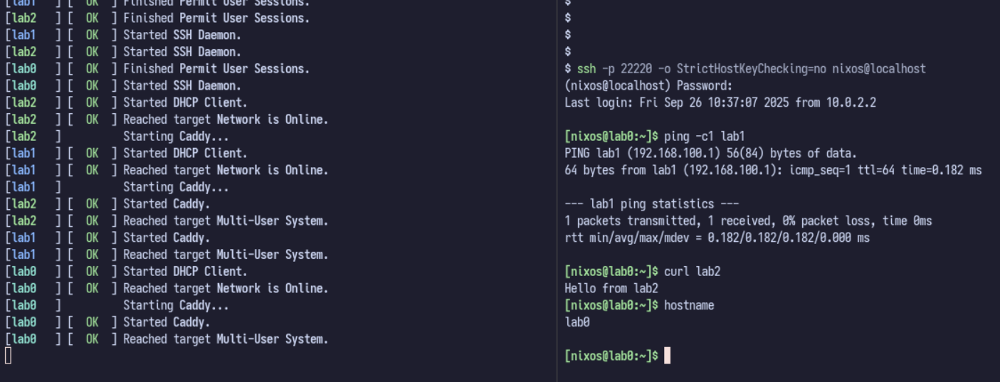

# NixOS VM Cluster

This is a template for running a cluster of NixOS VMs using QEMU. This can be useful for testing distributed systems, your NixOS configurations, learning or just having fun.

This is simply a template, so I invite you to fork and modify it to your needs. To start the cluster, simply run:

```
$ git clone https://github.com/viperML/cluster
$ cd cluster

$ nix run -f ./default.nix run -L
```


`default.nix` configures the virtual machines, by linking together their networks. With this configuration,
each machine is accesible from each other by their name, so you can simply do `ping lab0` from `lab1`, etc.

You can also access each machine by SSH. We forward the SSH port from the VM to the host port `22220 + i`, where `i` is the machine index (0, 1, 2, ...). The default user and password is `nixos` `nixos`, but you can add your own public key in `modules/base.nix`. The following command connects to `lab0`:

```
$ ssh -p 22220 -o StrictHostKeyChecking=no nixos@localhost
```

The QEMU machines run without any need of root privileges on the host system, using user-mode networking.



## Usage as a library

```
$ npins init
```
